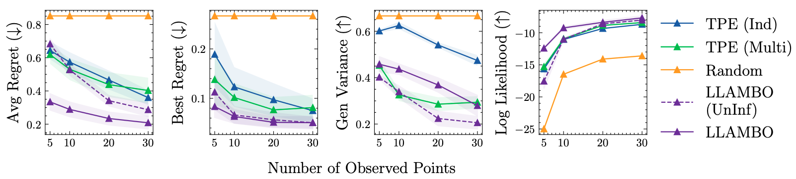
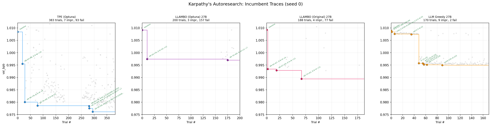

# autoresearch-automl

Karpathy's [autoresearch](https://github.com/karpathy/autoresearch) lets an LLM agent edit training code through trial and error, with no fixed search space, just code diffs. [Shwartz-Ziv showed](https://www.linkedin.com/posts/ravid-shwartz-ziv-8bb18761_do-llm-coding-agents-fool-us-karpathys-activity-7437556522240536576-ygrQ) that classical AutoML (TPE + expert HPs) already beats it. This makes autoresearch an excellent in-the-wild testbed to benchmark HPO methods, including newer LLM-based agent methods: unlike synthetic surrogates (HPOBench, YAHPO), every trial actually trains a model on a GPU, with real OOM failures, noisy evaluations, and mixed discrete/continuous hyperparameters. A promising direction is using LLMs as surrogate models inside Bayesian optimization: their knowledge about how people train ML models could serve as a prior for new surrogate models (see figure below). We compare classical HPO (TPE, CMA-ES, SMAC, Random Search), LLM-based HPO ([LLAMBO](https://arxiv.org/abs/2402.03921), Karpathy Agent), and a hybrid we propose called Centaur (CMA-ES as critic guides an LLM actor, inspired by actor-critic methods in RL, with CMA-ES providing interpretability of the optimization trajectory), all under fair conditions.


*Figure 6 from [Ye et al. (2024)](https://arxiv.org/abs/2402.03921): LLAMBO outperforms TPE in candidate sampling quality, especially with few observed points.*

## Methods

**Classical (fixed 14-HP search space):**
- **TPE:** Tree-structured Parzen Estimator ([Optuna](https://github.com/optuna/optuna)).
- **CMA-ES:** Covariance Matrix Adaptation Evolution Strategy ([Optuna CMA sampler](https://optuna.readthedocs.io/en/stable/reference/samplers/generated/optuna.samplers.CmaEsSampler.html)).
- **SMAC:** Sequential Model-based Algorithm Configuration with Random Forest surrogate ([SMAC3](https://github.com/automl/SMAC3)).
- **Random:** Uniform random sampling ([Optuna RandomSampler](https://optuna.readthedocs.io/en/stable/reference/samplers/generated/optuna.samplers.RandomSampler.html)).

**LLM-based (fixed 14-HP search space):**
- **LLAMBO (Optuna):** LLM as surrogate + candidate generator inside Bayesian optimization ([OptunaHub port](https://hub.optuna.org/samplers/llambo/)). The OptunaHub implementation has several issues: it uses binary surrogate labels (good/bad) instead of continuous values, delegates categorical HPs to random sampling, and hides failed trials from the surrogate (see [Details](#llambo-optuna-vs-llambo-paper)).
- **LLAMBO (Paper):** Our reimplementation faithful to the original paper, fixing the above issues: continuous surrogate labels, all HPs visible to the LLM, failed trials included ([Ye et al., 2024](https://arxiv.org/abs/2402.03921), [original code](https://github.com/tennisonliu/LLAMBO)).
- **Karpathy Agent (14 HPs):** LLM sees trial history and suggests the next config within the fixed search space. No surrogate model, pure LLM suggestion.

**LLM-based (open, no fixed search space):**
- **Karpathy Agent (Code):** LLM directly edits `train.py` source code each trial. Can change any constant, not just the 14 extracted HPs ([Karpathy's autoresearch](https://github.com/karpathy/autoresearch)).

**Hybrid (fixed 14-HP search space):**
- **Centaur:** CMA-ES as *critic* learns from 100% of trials (always refitting its covariance structure). On 30% of trials the LLM acts as *actor*, receiving CMA-ES internal state (mean, sigma, top configs) to make informed suggestions. The remaining 70% CMA-ES serves as the actor. See [centaur.md](centaur.md).

All LLM methods use self-hosted Qwen3.5 (0.8B and 27B) via vLLM on the same GPU as training.

## Setup

Single H200 GPU, 5 min/trial, minimize val_bpb. Search space: 14 HPs auto-extracted from `train.py` via AST (no manual curation). 3 seeds per condition.

**Fairness:** All methods get 24 hours of GPU training time (excluding LLM inference overhead), capped to ~76 GB VRAM (matching LLM methods' available memory after vLLM). Failed trials reported as `val_bpb=100.0` so samplers learn to avoid OOM regions.

## Results

### All Methods

Convergence curves (mean ± std across available seeds). Includes classical methods (TPE, CMA-ES, Random, SMAC), LLM-based (LLAMBO, Karpathy Agent (14 HPs), Karpathy Agent (Code)), and hybrid (Centaur).


### 27B + Classical

27B LLM backends compared against classical methods. CMA-ES and TPE lead; Centaur is the best LLM-involving method.


### Incumbent Traces (seed 0)

Grey dots are all trials, colored dots are new bests, staircase is the incumbent (best-so-far).



### Centaur: CMA-ES Guided LLM Optimization

We introduce **Centaur**, a hybrid backend where CMA-ES acts as *critic* and an LLM acts as *actor*. CMA-ES runs every trial, learning the optimization landscape (covariance structure, convergence direction). On a fraction of trials (30%, after 10 warmup trials), the LLM receives CMA-ES's internal state — distribution mean, step-size sigma, top configs — and uses it alongside transformer domain knowledge to suggest configs. CMA-ES learns from all results, including LLM-suggested ones. See [centaur.md](centaur.md) for the full algorithm and related work comparison.

### Search Diversity Analysis

To understand *why* some methods outperform others, we measure how each backend explores the 13-dimensional continuous HP space. All values are normalized to [0,1] within their bounds. Only successful (non-OOM) trials are included.

**Metrics:**
- **Spread:** mean per-HP standard deviation (higher = more diverse sampling across each dimension)
- **Pairwise:** mean L2 distance between all config pairs (higher = configs are more different from each other)
- **Dist→Default:** mean L2 distance from Karpathy's default config (higher = exploring further from the starting point)
- **Step:** mean L2 distance between consecutive trials (higher = larger jumps between suggestions)
- **Cells:** unique cells when discretizing each HP into 5 bins (higher = more coverage of the search space)

| Method | Seeds | Avg Best | OOM% | Spread | Pairwise | Dist→Default | Step | Cells |
|--------|-------|----------|------|--------|----------|-------------|------|-------|
| CMA-ES | 2 | **0.9795** | 0% | 0.138 | 0.697 | 0.889 | 0.561 | 220 |
| TPE | 2 | **0.9821** | 0% | 0.196 | 0.963 | 1.288 | 0.569 | 169 |
| Centaur [27B] | 1 | **0.9848** | 0% | 0.126 | 0.611 | 1.064 | 0.541 | 88 |
| LLAMBO (Paper) [27B] | 3 | 0.9880 | 0% | 0.255 | 1.272 | 1.127 | 1.210 | 357 |
| Random | 2 | 0.9893 | 56% | 0.274 | 1.388 | 1.243 | 1.391 | 169 |
| LLAMBO (Optuna) [27B] | 3 | 0.9905 | 84% | 0.164 | 0.843 | 0.968 | 0.696 | 78 |
| Karpathy Agent (14 HPs) [27B] | 3 | 0.9930 | 1% | 0.020 | 0.101 | 0.249 | 0.059 | 14 |
| SMAC | 2 | 1.0045 | 44% | 0.241 | 1.199 | 1.115 | 0.450 | 36 |

**Observations:**

- **Karpathy Agent (14 HPs) has the lowest diversity by all metrics.** Spread 0.020 (14x less than random), only 14 unique grid cells, dist→default 0.249. It makes minimal changes between trials (step 0.059).
- **LLAMBO (Optuna) has 84% OOM rate** (up to 93% for seed 2), due to random categorical sampling of DEPTH.
- **LLAMBO (Paper) is the most diverse method with 0% OOM** (spread 0.255, 357 unique cells), yet still underperforms CMA-ES and TPE.
- **The top 3 methods (CMA-ES, TPE, Centaur) all have 0% OOM and moderate diversity** (spread 0.12–0.20).
- **SMAC has high spread (0.241) but only 36 unique cells.** It revisits similar configs while also producing 44% OOM. This is partly due to a bug where OOM trials were marked as `SUCCESS` instead of `MEMORYOUT`, preventing the GP surrogate from learning to avoid infeasible regions (fix included in this repo, rerun pending).
- **Performance correlates more with OOM rate than with diversity.** All 0%-OOM methods outperform all high-OOM methods, suggesting that on this task, learning to avoid infeasible regions may matter more than LLM domain knowledge or search diversity.

## Usage

```bash
uv venv --python 3.12
source .venv/bin/activate
uv pip install -e ".[dev,all]"

# TPE
python -m autoresearch_automl.cli run --backend optuna --trials 100 --seed 0

# Random Search
python -m autoresearch_automl.cli run --backend random --trials 100 --seed 0

# SMAC3
python -m autoresearch_automl.cli run --backend smac --trials 100 --seed 0

# CMA-ES
python -m autoresearch_automl.cli run --backend cma_es --trials 100 --seed 0

# LLAMBO (Optuna) (requires vLLM running)
export OPENAI_BASE_URL=http://127.0.0.1:8000/v1
export OPENAI_API_KEY=dummy
python -m autoresearch_automl.cli run --backend llambo --trials 100 --llm-model Qwen3.5-0.8B

# LLAMBO (Paper)
python -m autoresearch_automl.cli run --backend llambo_original --trials 100 --llm-model Qwen3.5-0.8B

# Karpathy Agent (14 HPs)
python -m autoresearch_automl.cli run --backend llm_greedy --trials 100 --llm-model Qwen3.5-0.8B
```

## Related work

- [Karpathy's autoresearch](https://github.com/karpathy/autoresearch) for the training task and the idea of LLM-driven experimentation
- [Ravid Shwartz-Ziv](https://www.linkedin.com/posts/ravid-shwartz-ziv-8bb18761_do-llm-coding-agents-fool-us-karpathys-activity-7437556522240536576-ygrQ) for showing that expert HP selection beats blind LLM search
- [LLAMBO (Ye et al., 2024)](https://arxiv.org/abs/2402.03921) for using LLMs as surrogate models in Bayesian optimization

## Details

### H200 vs H100 baseline offset

Our baseline (Karpathy's default config) achieves val_bpb=1.008 on H200, while Karpathy reports ~0.998 on H100. Same code, same config, same `torch.compile` + FA3. The gap is entirely due to **GPU power throttling**: H200's HBM3e memory (4.8 TB/s) draws more power than H100's HBM3 (3.35 TB/s), leaving less of the shared 700W TDP for the SMs. Under sustained load, our H200 clocks down to ~1600 MHz (81% of max 1980 MHz), yielding 18% fewer training steps per 5-minute trial. Adjusting for actual clock speed, compute efficiency is identical (40.3% vs 39.8% MFU). This baseline offset does not affect HPO convergence.

### LLAMBO (Optuna) vs LLAMBO (Paper)

While integrating LLAMBO, we discovered that the [OptunaHub LLAMBO sampler](https://hub.optuna.org/samplers/llambo/) (LLAMBO (Optuna)) differs from the [original paper code](https://github.com/tennisonliu/LLAMBO) (LLAMBO (Paper)) in several ways that materially affect optimization quality. OptunaHub does great work making research accessible — these notes are meant to help users who need paper-faithful behavior.

**Key differences:**

| Aspect | Original paper | OptunaHub port |
|--------|---------------|----------------|
| **Surrogate labels** | Actual metric values (`## 0.970 ##`) — LLM sees performance gradients | Binary 0/1 (top 20% threshold) — LLM only sees "good" vs "bad" |
| **Categorical HPs** | All HPs included in LLM prompts | Categoricals delegated to random sampling, invisible to LLM |
| **Failed trials** | Visible to surrogate (can learn infeasible regions) | Marked as `TrialState.FAIL`, invisible to surrogate |

**Impact on our experiments:** The categorical delegation was the most painful. Our `WINDOW_PATTERN` hyperparameter (attention pattern per layer) strongly affects VRAM usage and model quality, but the OptunaHub port samples it randomly — the LLM never sees or reasons about it. The binary labeling also loses information: the LLM can't distinguish a config scoring 0.99 from one scoring 1.50, they're both "good" or both "bad" depending on the threshold.

We implemented a [faithful adaptation](autoresearch_automl/backends/llambo_original/) of the paper's code (LLAMBO (Paper), `--backend llambo_original`) alongside the OptunaHub version (LLAMBO (Optuna), `--backend llambo`) to quantify these differences. Both are included in our benchmark.
