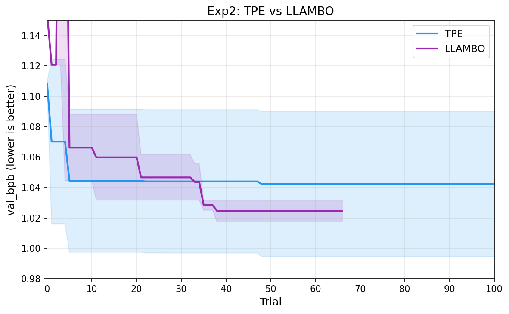
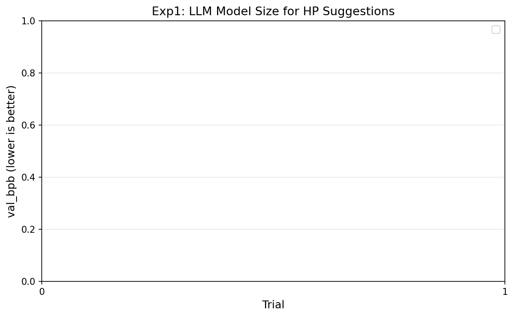
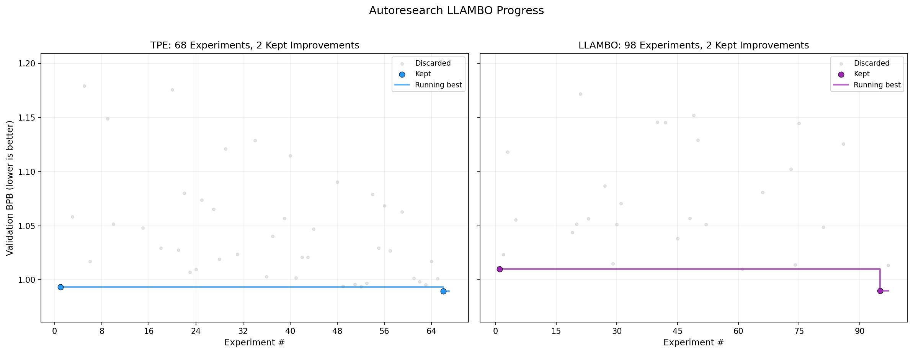

# autoresearch-automl

Karpathy's [autoresearch](https://github.com/karpathy/autoresearch) lets an LLM agent tweak training code through trial and error. Ravid Shwartz-Ziv [showed](https://www.linkedin.com/posts/ravid-shwartz-ziv-8bb18761_do-llm-coding-agents-fool-us-karpathys-activity-7437556522240536576-ygrQ) that model-based optimization (Optuna TPE + expert-picked hyperparameter search space) already beats it. We fill the gap by integrating [LLAMBO (Ye et al., 2024)](https://arxiv.org/abs/2402.03921) into autoresearch, an approach that puts the LLM inside model-based optimization, using it as both surrogate model and candidate generator.

As an AutoML enthusiast, it felt natural to fill this void — this repo applies LLAMBO to Karpathy's autoresearch problem and benchmarks it against TPE.


*Figure 6 from [Ye et al. (2024)](https://arxiv.org/abs/2402.03921): LLAMBO outperforms TPE in candidate sampling quality, especially with few observed points.*

## Setup

I run [Optuna](https://github.com/optuna/optuna) TPE and [LLAMBO via OptunaHub](https://hub.optuna.org/samplers/llambo/) on Karpathy's autoresearch training task: single GPU, 5 min budget per trial, minimize val_bpb. The search space (14 hyperparameters) is extracted automatically from train.py by parsing the source code for ALL_CAPS variable assignments. No manual HP curation. Ravid Shwartz-Ziv showed that expert-picked HPs matter. I deliberately avoid expert curation to test whether LLAMBO can compensate through pretrained knowledge.

LLAMBO uses self-hosted open source LLMs (Qwen3.5 via vLLM), running on the same GPU as training. I also compare different LLM sizes to check whether a larger model actually produces better suggestions. No API keys, no proprietary models, fully reproducible.

**Note on failure handling:** Infeasible configs (OOM, batch size assertion errors) are reported to the sampler as `val_bpb=100.0` instead of being silently dropped. Both TPE and LLAMBO otherwise ignore failed trials (`TrialState.FAIL`), which means they never learn to avoid bad regions. The penalty value is hardcoded for this task (real val_bpb ranges 0.99–2.4) — for other tasks, this would need adjustment.

## Results (in progress)

### TPE vs LLAMBO

LLAMBO converges faster in the first ~20 trials. TPE catches up given enough budget. Experiments still running (24h Slurm jobs, 3 seeds each).



### LLM model size

0.8B finds good configs from the start. 9B starts worse but converges to the same level after ~15 trials. Bigger is not better for HP suggestions.



### Autoresearch LLAMBO Progress

Grey dots are discarded trials, colored dots are new bests, staircase is the running best.



## Usage

```bash
uv venv --python 3.12
source .venv/bin/activate
uv pip install -e ".[dev,all]"

# TPE
python -m autoresearch_automl.cli run --backend optuna --trials 100 --seed 0

# LLAMBO (requires vLLM running)
export OPENAI_BASE_URL=http://127.0.0.1:8000/v1
export OPENAI_API_KEY=dummy
python -m autoresearch_automl.cli run --backend llambo --trials 100 --llm-model Qwen3.5-0.8B
```

## Note: OptunaHub LLAMBO vs Original Paper

While integrating LLAMBO, we discovered that the [OptunaHub LLAMBO sampler](https://hub.optuna.org/samplers/llambo/) differs from the [original paper code](https://github.com/tennisonliu/LLAMBO) in several ways that materially affect optimization quality. OptunaHub does great work making research accessible — these notes are meant to help users who need paper-faithful behavior.

**Key differences:**

| Aspect | Original paper | OptunaHub port |
|--------|---------------|----------------|
| **Surrogate labels** | Actual metric values (`## 0.970 ##`) — LLM sees performance gradients | Binary 0/1 (top 20% threshold) — LLM only sees "good" vs "bad" |
| **Categorical HPs** | All HPs included in LLM prompts | Categoricals delegated to random sampling, invisible to LLM |
| **Failed trials** | Visible to surrogate (can learn infeasible regions) | Marked as `TrialState.FAIL`, invisible to surrogate |

**Impact on our experiments:** The categorical delegation was the most painful. Our `WINDOW_PATTERN` hyperparameter (attention pattern per layer) strongly affects VRAM usage and model quality, but the OptunaHub port samples it randomly — the LLM never sees or reasons about it. The binary labeling also loses information: the LLM can't distinguish a config scoring 0.99 from one scoring 1.50, they're both "good" or both "bad" depending on the threshold.

We implemented a [faithful adaptation](autoresearch_automl/backends/llambo_original/) of the paper's code (`--backend llambo_original`) alongside the OptunaHub version (`--backend llambo`) to quantify these differences. Both are included in our benchmark.

## Related work

- [Karpathy's autoresearch](https://github.com/karpathy/autoresearch) for the training task and the idea of LLM-driven experimentation
- [Ravid Shwartz-Ziv](https://www.linkedin.com/posts/ravid-shwartz-ziv-8bb18761_do-llm-coding-agents-fool-us-karpathys-activity-7437556522240536576-ygrQ) for showing that expert HP selection beats blind LLM search
- [LLAMBO (Ye et al., 2024)](https://arxiv.org/abs/2402.03921) for using LLMs as surrogate models in Bayesian optimization
