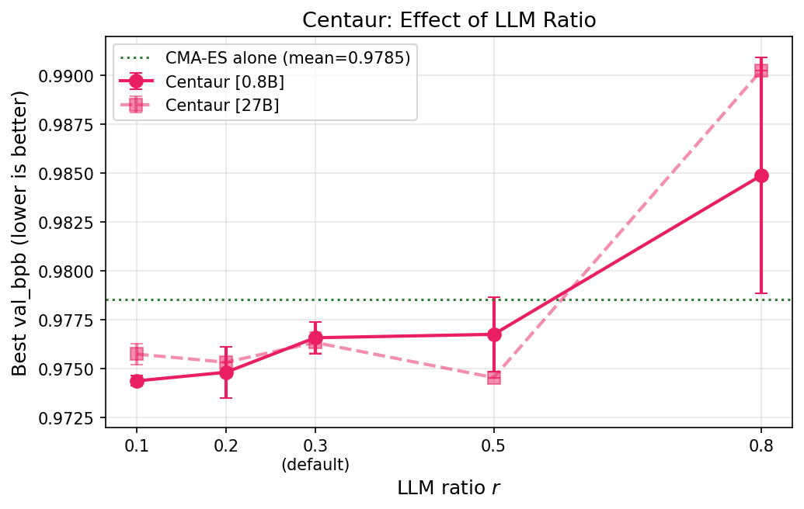

<h2 align="center"><code>autoresearch-automl</code></h2>
<h3 align="center">Can LLMs Beat Classical Hyperparameter Optimization Algorithms?</h3>
<h4 align="center">A Study on <i>autoresearch</i></h4>

> **Paper in progress.** All results are now final with 3 seeds for all 9 methods. Earlier versions shared on LinkedIn used 2 seeds for Karpathy Agent (Code) [27B]; the third seed performed notably worse, widening the gap between this method and classical HPO. The plots and tables below reflect the complete 3-seed results.


## Introduction

[autoresearch](https://github.com/karpathy/autoresearch) enables an LLM agent to search for optimal hyperparameter configurations on an unconstrained search space by editing the training code directly. [Shwartz Ziv](https://www.linkedin.com/posts/ravid-shwartz-ziv-8bb18761_do-llm-coding-agents-fool-us-karpathys-activity-7437556522240536576-ygrQ) showed that TPE with expert hyperparameters can beat Karpathy's agent. We use autoresearch as a testbed to compare classical hyperparameter optimization (HPO) algorithms against LLM-based methods on tuning the hyperparameters of a small language model. We benchmark 9 methods — 4 classical, 4 LLM-based, and 1 hybrid — all under the same 24-hour GPU training budget with 3 seeds.

## Methods

**Classical (fixed [14-HP search space](#search-space)):**
- **TPE:** Tree-structured Parzen Estimator ([Optuna](https://github.com/optuna/optuna)).
- **CMA-ES:** Covariance Matrix Adaptation Evolution Strategy ([Optuna CMA sampler](https://optuna.readthedocs.io/en/stable/reference/samplers/generated/optuna.samplers.CmaEsSampler.html)).
- **SMAC:** Sequential Model-based Algorithm Configuration with Random Forest surrogate ([SMAC3](https://github.com/automl/SMAC3)).
- **Random:** Uniform random sampling ([Optuna RandomSampler](https://optuna.readthedocs.io/en/stable/reference/samplers/generated/optuna.samplers.RandomSampler.html)).

**LLM-based (fixed [14-HP search space](#search-space)):**
- **LLAMBO (Optuna):** LLM as surrogate + candidate generator inside Bayesian optimization ([OptunaHub port](https://hub.optuna.org/samplers/llambo/)). Uses binary surrogate labels, delegates categorical HPs to random sampling, and hides failed trials from the surrogate (see [Details](#llambo-optuna-vs-llambo-paper)).
- **LLAMBO (Paper):** Our reimplementation faithful to the original paper: continuous surrogate labels, all HPs visible to the LLM, failed trials included ([Ye et al., 2024](https://arxiv.org/abs/2402.03921)).
- **Karpathy Agent (14 HPs):** LLM sees trial history and suggests the next config within the fixed search space.

**LLM-based (unconstrained search space):**
- **Karpathy Agent (Code):** LLM directly edits `train.py` source code each trial ([Karpathy's autoresearch](https://github.com/karpathy/autoresearch)).

**Hybrid (fixed [14-HP search space](#search-space)):**
- **Centaur (CMA-ES+LLM):** CMA-ES runs every trial; on 30% of trials, the LLM receives CMA-ES's internal state and suggests a config. CMA-ES updates from all results, including LLM-suggested ones. See [centaur.md](centaur.md).

All LLM methods use self-hosted Qwen3.5 (0.8B and 27B) as the LLM optimizer via vLLM on the same GPU that trains the optimizee (~50M parameter language model).

## Experimental Setup

Single H200 GPU, 5 min/trial, minimize val_bpb. Search space: 14 HPs auto-extracted from `train.py` via [AST](https://docs.python.org/3/library/ast.html) parsing (every `ALL_CAPS = literal` assignment becomes a tunable HP). All methods get 24 hours of GPU training time (excluding LLM inference overhead), capped to ~80 GB VRAM (to match the H100 used in Karpathy's and Shwartz Ziv's experiments). Failed trials reported as `val_bpb=100.0` so optimizers learn to avoid OOM regions. 3 seeds per condition.

## Results

### Classical methods outperform LLMs in fixed search spaces

Within the fixed search space, classical HPO methods consistently outperform LLM-based agents. The gap to the best fixed-space LLM method (LLAMBO Paper at 0.9862) is substantial, and several pure LLM methods perform worse than random search, indicating that restricting LLMs to a fixed HP search space does not leverage their strengths. OOM avoidance matters more than search diversity: the top methods all keep OOM rates below 16%, while the bottom four exceed 36%.

| Method | Seeds | Best val_bpb | OOM% |
|--------|-------|-------------|------|
| Centaur [27B] | 3 | **0.9763 ± 0.0005** | 15% |
| Centaur [0.8B] | 3 | **0.9766 ± 0.0008** | 15% |
| TPE | 3 | **0.9768 ± 0.0019** | 11% |
| SMAC | 3 | **0.9778 ± 0.0020** | 36% |
| CMA-ES | 3 | **0.9785 ± 0.0036** | 16% |
| Karpathy Agent (Code) [27B] | 3 | **0.9814 ± 0.0046** | 12% |
| LLAMBO (Paper) [27B] | 3 | 0.9862 ± 0.0041 | 48% |
| Random | 3 | 0.9873 ± 0.0021 | 56% |
| LLAMBO (Optuna) [27B] | 3 | 0.9882 ± 0.0012 | 61% |
| Karpathy Agent (14 HPs) [27B] | 3 | 0.9904 ± 0.0002 | 1% |

### Unconstrained code editing is viable but requires model scale

Karpathy Agent (Code), which directly edits training source code, is the only pure LLM method competitive with classical approaches. Given the simplicity of the setup and the use of a self-hosted open-weight model (Qwen3.5-27B), the gap to classical methods is smaller than one might expect, and stronger frontier models may close it further.

Scaling the LLM from 0.8B to 27B is essential for unconstrained code editing (0.9910 vs 0.9814) but provides no advantage for fixed-HP optimization. Solid lines = 27B, dashed = 0.8B.


### Hybrid optimization: best of both worlds

Centaur outperformed all methods including CMA-ES alone by using the LLM on only 30% of trials. The LLM receives CMA-ES's full internal state (mean vector, step-size, covariance matrix), the top-5 configurations, and the last 20 trials. Centaur substantially reduces CMA-ES's cross-seed variance (std 0.0005 vs 0.0036), suggesting the LLM stabilizes the optimizer. Notably, Centaur [0.8B] outperformed Centaur [27B], demonstrating that a cheap LLM suffices when paired with a strong classical optimizer.

We ablate the LLM ratio: higher ratios degrade performance, confirming that CMA-ES should retain majority control. See [centaur.md](centaur.md) for the full algorithm.



### Incumbent Traces

Grey dots are all trials, colored dots are new bests, staircase is the incumbent (best-so-far). Each panel shows the best seed for that method.

**Classical + Hybrid:**


**LLM-based:**


## Search Space

14 hyperparameters auto-extracted via AST parsing (every `ALL_CAPS = literal` assignment in `train.py`):

| HP | Type | Range | Log | Default |
|----|------|-------|-----|---------|
| DEPTH | int | 4 – 24 | | 8 |
| ASPECT_RATIO | int | 32 – 128 | | 64 |
| HEAD_DIM | int | 64 – 256 | yes | 128 |
| DEVICE_BATCH_SIZE | int | 32 – 256 | yes | 128 |
| TOTAL_BATCH_SIZE | int | 65 536 – 2 097 152 | yes | 524 288 |
| EMBEDDING_LR | float | 0.01 – 2.0 | yes | 0.6 |
| UNEMBEDDING_LR | float | 0.0005 – 0.05 | yes | 0.004 |
| MATRIX_LR | float | 0.005 – 0.2 | yes | 0.04 |
| SCALAR_LR | float | 0.05 – 2.0 | yes | 0.5 |
| WEIGHT_DECAY | float | 0.0 – 0.5 | | 0.2 |
| WARMUP_RATIO | float | 0.0 – 0.3 | | 0.0 |
| WARMDOWN_RATIO | float | 0.1 – 0.8 | | 0.5 |
| FINAL_LR_FRAC | float | 0.0 – 0.2 | | 0.0 |
| WINDOW_PATTERN | categorical | SSSL, SSLL, SLSL, LLLL, SSSS, LSSL | | SSSL |

Defaults are Karpathy's starting config (commit `b11d6f28`), not his final optimized values.

## Usage

```bash
uv venv --python 3.12
source .venv/bin/activate
uv pip install -e ".[dev,all]"

# TPE
python -m autoresearch_automl.cli run --backend optuna --trials 100 --seed 0

# Random Search
python -m autoresearch_automl.cli run --backend random --trials 100 --seed 0

# SMAC3
python -m autoresearch_automl.cli run --backend smac --trials 100 --seed 0

# CMA-ES
python -m autoresearch_automl.cli run --backend cma_es --trials 100 --seed 0

# LLAMBO (Optuna) (requires vLLM running)
export OPENAI_BASE_URL=http://127.0.0.1:8000/v1
export OPENAI_API_KEY=dummy
python -m autoresearch_automl.cli run --backend llambo --trials 100 --llm-model Qwen3.5-0.8B

# LLAMBO (Paper)
python -m autoresearch_automl.cli run --backend llambo_original --trials 100 --llm-model Qwen3.5-0.8B

# Karpathy Agent (14 HPs) — LLM suggests configs within fixed search space
python -m autoresearch_automl.cli run --backend karpathy_agent_hps --trials 100 --llm-model Qwen3.5-0.8B

# Karpathy Agent (Code) — edits train.py directly
python -m autoresearch_automl.cli run --backend karpathy_agent --trials 100 --llm-model Qwen3.5-0.8B

# Centaur (CMA-ES+LLM)
python -m autoresearch_automl.cli run --backend centaur --trials 100 --llm-model Qwen3.5-0.8B
```

## Related work

- [Karpathy's autoresearch](https://github.com/karpathy/autoresearch) for the training task and the idea of LLM-driven experimentation
- [Ravid Shwartz Ziv](https://www.linkedin.com/posts/ravid-shwartz-ziv-8bb18761_do-llm-coding-agents-fool-us-karpathys-activity-7437556522240536576-ygrQ) for showing that expert HP selection beats blind LLM search
- [LLAMBO (Ye et al., 2024)](https://arxiv.org/abs/2402.03921) for using LLMs as surrogate models in Bayesian optimization

## Details

### H200 vs H100 baseline

Our baseline (Karpathy's default config) achieves val_bpb ≈ 0.991 on H200 at full clock speed (~1750K tokens/s), comparable to Karpathy's ~0.998 on H100. Early runs showed a higher baseline of ~1.008 due to GPU power throttling. All results reported here use non-throttled H200s.

### LLAMBO (Optuna) vs LLAMBO (Paper)

The [OptunaHub LLAMBO sampler](https://hub.optuna.org/samplers/llambo/) differs from the [original paper code](https://github.com/tennisonliu/LLAMBO) in several ways that materially affect optimization quality:

| Aspect | Original paper | OptunaHub port |
|--------|---------------|----------------|
| **Surrogate labels** | Actual metric values, LLM sees performance gradients | Binary 0/1 (top 20% threshold) |
| **Categorical HPs** | All HPs included in LLM prompts | Categoricals delegated to random sampling |
| **Failed trials** | Visible to surrogate (can learn infeasible regions) | Hidden from surrogate |

We implemented a [faithful adaptation](autoresearch_automl/backends/llambo_original/) of the paper's code alongside the OptunaHub version to quantify these differences.

## Citation

```bibtex
@misc{ferreira2026autoresearchautoml,
    title={Can LLMs Beat Classical Hyperparameter Optimization Algorithms? A Study on autoresearch},
    author={Fabio Ferreira and Lucca Wobbe and Arjun Krishnakumar and Frank Hutter and Arber Zela},
    year={2026},
    howpublished={\url{https://github.com/ferreirafabio/autoresearch-automl}},
}
```
